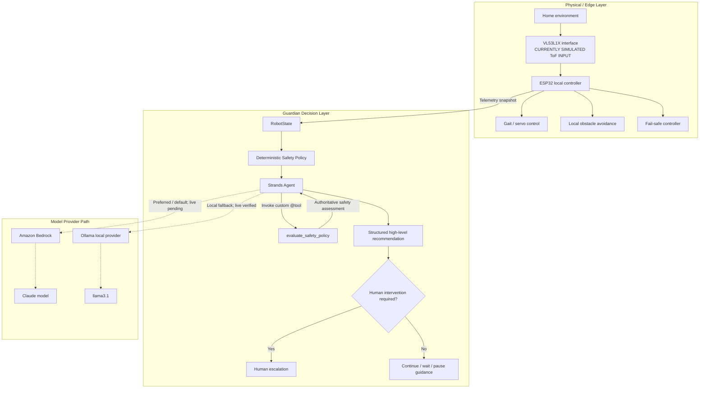

# GuardianPaw Submission Architecture

GuardianPaw separates time-critical robot safety from high-level interpretation. Solid arrows show the current data and decision design. Dotted arrows show explicitly selected model-provider paths: Amazon Bedrock is preferred/default and still awaits live verification, while the Ollama local fallback has completed live Strands inference with `llama3.1`. Provider failure never triggers a silent fallback.

The editable Mermaid source is also available in [`architecture.mmd`](architecture.mmd).

## Responsibility Boundary

| Layer | Owns | Must not delegate |
|---|---|---|
| ESP32 local controller | Gait, servo output, immediate stop, local obstacle response, and fail-safe state | Immediate physical safety |
| Deterministic policy | Hard risk classification, patrol permission, and required human escalation | Safety constraints that a model could weaken |
| Strands Agent | Telemetry interpretation, explanation, and high-level recommendation | Servo commands or overrides of local safety |
| Human | Inspection and recovery when telemetry or hardware cannot be trusted | N/A |

The model can add context and explanation, but deterministic post-enforcement fixes the final risk level, patrol permission, escalation flag, and required safe action.

## Verification Boundary

- **Verified on physical ESP32:** Phase 1-A simulated distances, complete avoidance state transitions, and Dry Run isolation of avoidance-triggered actuators.
- **Verified offline:** deterministic policy tests and the four-scenario policy-only CLI demo.
- **Verified with live local inference:** Strands Agent, OllamaModel with `llama3.1`, explicit `evaluate_safety_policy` custom-tool execution, Pydantic structured output, and deterministic post-enforcement completed all four simulated-telemetry scenarios.
- **Implemented but not live-verified:** Strands-to-Bedrock inference; AWS account/payment activation is pending.
- **Not verified:** physical VL53L1X ranging, D21/D22 I2C wiring, autonomous physical avoidance, MPU6050, and vision.

The verified Ollama run emitted a non-fatal warning that forced `ToolChoice` is unsupported. GuardianPaw's safety flow still worked because it explicitly invokes the registered safety tool before model reasoning and deterministically enforces the assessment again after structured output.
